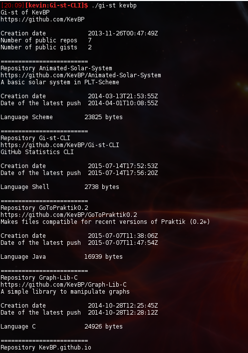

# Gi-st-CLI
## GitHub Statistics CLI
### What is Gi-st CLI ?
Gi-st CLI is a script written in Bash to extract information about a GitHub's user.
List of gotten information :
* User information :
  * Username
  * URL of the user page on GitHub
  * Creation date
  * Number of publics repositories and gists
* Repository information :
  * Name of the repository
  * URL
  * Its description
  * Creation date
  * Date of the latest push
  * Used languages and their size in bytes

### Demonstration

